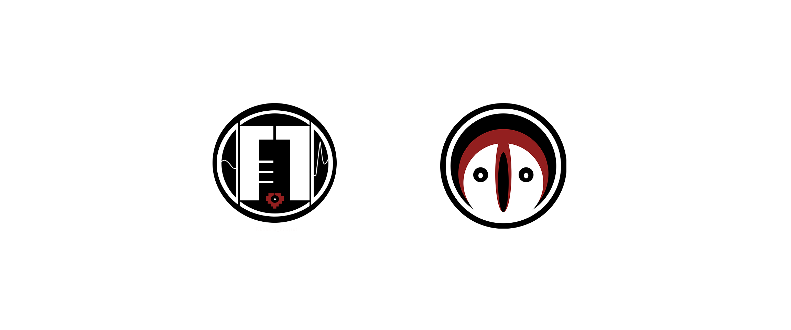

# ▉ Introduction ▉  

Hello, I am a 3D modeler and my models are mainly used for Mikumikudance.

## The commissioned work can be used in other programs, but you will need a third party for format conversion and re-rig, and I'm sorry I can't provide conversion services at this time.|´Å`)ﾉ 

# ▉ 3d model prices FOR Vtuber ▉  

## NOTE: This pricing is for a model optimised for MMD ONLY and will be recieved in the .pmx file type. I do not currently provide files for use with VR and VSF, but you can use an external program to convert the format.

### streaming commercially price 

Modeling-combo start at 800 USD

● face and body mesh

● rig and dynamic

● 40 blendshapes

● full textures

Add-on:

+150 USD+ if you need a base as a seperate rig

+100 USD+ if you need hair

+500 USD+ if you need outfit (top,bottom,shoes)

+50 USD/each for additional props or parts

+20 USD/each if you need to make additional custom blendshapes

All prices are for reference only, depending on the complexity of the design.Most models will be 1600 USD+

# ▉ 3d model prices FOR Private/fanmade model ▉  

### Pricenon-commercial Prices

Modeling-combo start at 350 USD

● face and body mesh

● rig and dynamic

● 30 blendshapes

● full textures

Add-on:

+50 USD+ if you need a base as a seperate rig

+100 USD+ if you need hair

+300 USD+ if you need outfit (top,bottom,shoes)

+25 USD/each for additional props or parts

+10 USD/each if you need to make additional custom blendshapes

All prices are for reference only, depending on the complexity of the design.Most models will be 800 USD+

# ▉ Commission Process ▉  

● Negotiated price

● Deposit payment (50% of total)

● weekly feedback

● Final Check and deliver the model

● Rest payment (50% of total)

# ▉ speciality and limitations ▉  

### I specialize in:

● 3D model with more than 95% similarity to the Live 2D art/reference sheet you provided.

● Diverse costumes can be made, including uncommon decorations such as extensive armor, scales, and exoskeletons.

● I can make furry & robotic humanoid modding, but it is important to note that they have an extra price. Please DM me for a detailed discussion.

● please refer to my twitter for more references :3

### I do not offer the following options:

● hyper-realistic models

● explicit R18 content.

● I am unable to model unclear designs, multiple references, and verbal descriptions. Please be 100% sure of what you want from the start

# ▉ FAQ ▉ 

###  Can the commissioned model be used for NSFW?

◆ Sure, I can't make R18 content but it is feasible for R18 and NSFW.

###  can you make a head or base only?

◆ Sorry, I'm not accepting at the moment.

### For some reason I don't want to commission anymore, can I cancel it?

◆ Yes, but I will not return the deposit that already paid. To avoid this, please double check before you pay the deposit.

### When do I get feedback? is it possible for me to change anything?

◆ I will update as soon as the commission begins, usually once a week and more frequently as we get closer to delivery.

You can always tell me what needs to be replaced or changed before I start working on the part you want to change, otherwise I won't change it.

Before the rig phase, I can accept substantial modifications (I will inform you) After the rig, all major modifications will be additionally priced.

### I am a returning customer, can I customize new outfit?

◆ Sure, just provide me with an image or concept design of your new outfit and I can make it for you.

# ▉ Disclaimers ▉  

-After delivery of the model, I have the right to post the model line drawing or preview video to social media platforms without confidentiality requirements.

-I will not be responsible for any infringement issues arising from the author's side.

-I will not be responsible for any problems found after one week from the date of delivery.

-In order to avoid other copyright disputes, if the client needs to use the model for commercial purposes other than commercial streamming, please negotiate in advance.

# ▉ Contact ME ▉  

Twitter：EUthana_Lau  https://twitter.com/EUthana_Lau

Bilibili UID：4165826  Bilibili space：https://space.bilibili.com/4165826

