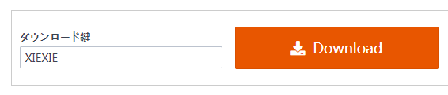
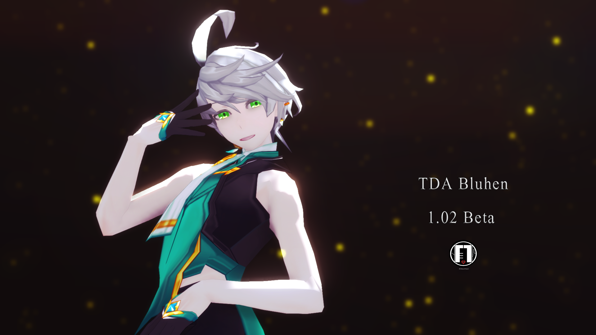
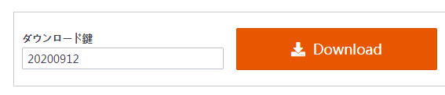
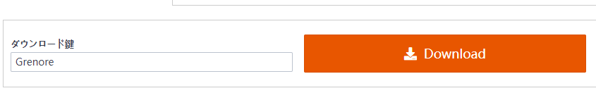
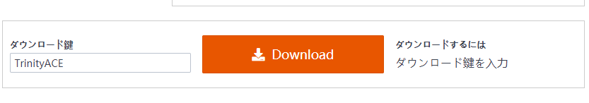
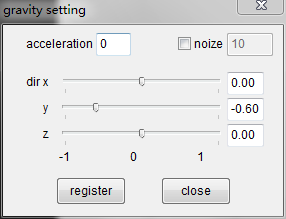
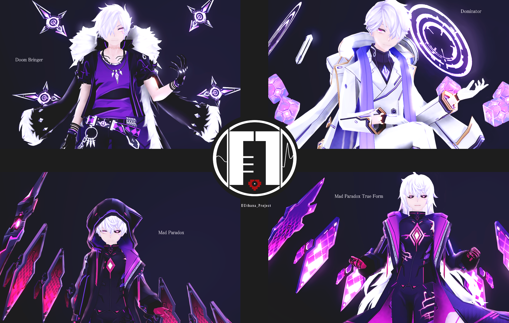
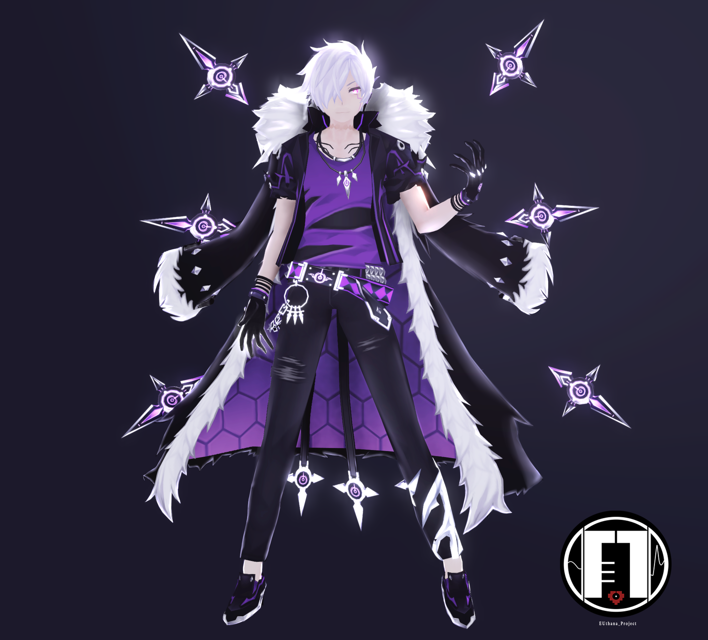
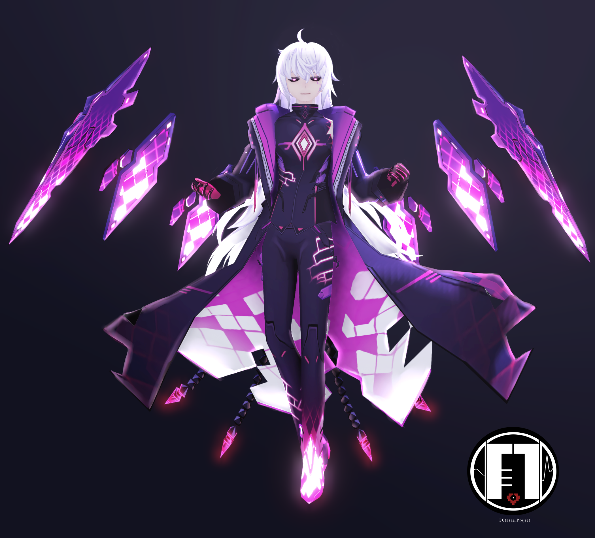

 

# ▉ 模型下载 ▉  

## ▏2021.1.13 诺亚Liberator及月之领导者模组整合▏

### ▶ [BowlRoll 下载](https://bowlroll.net/file/245292)

### ● bowlroll 密码:

月之领导者的姓氏是什么？请用英文输入（首字母需大写）

## ▏2020.12.27 2020艾索德生日贺礼 ▏

### ▶ [BowlRoll 下载](https://bowlroll.net/file/243746)

### ● bowlroll 密码:

艾尔之光是由哪个游戏工作室制作的？（全英文大写）

### ● Zip 解压密码:
骑士统领在使用哪个技能的时，眼睛会完全变蓝（全英文小写无空格，总计17个字符）

#### 密码提示

询问艾索德玩家，或者自强Elwiki

## ▏2020.11.16 金请夏-Snapping 舞台 ▏

### ▶ [BowlRoll 下载](https://bowlroll.net/file/240824)

## ▏2020.11.16 统御家&赫尼尔合集 ▏

### ▶ [BowlRoll 下载页面](https://bowlroll.net/file/240825)

### ● bowlroll 密码:

## ▏2020.09.12 Ain 绽情师实验模型 Beta版本 ▏

### ▶ [BowlRoll 下载页面](https://bowlroll.net/file/236010)

### ● bowlroll 密码:

## ▏2020.05.10 爱德华&格蕾丝模型整合 ▏

### ▶ [BowlRoll 下载页面](https://bowlroll.net/file/225888)

### ● bowlroll 密码:

### ● Zip 解压密码:

为了保护爱德华，他的母亲将他送往多少年后的未来？（请用纯数字回答）

#### 密码提示

你可以在艾迪有声漫画系列，以及领导者系列副本剧情或者 [格蕾丝人物页面](https://elwiki.net/w/Grace)找到密码信息

## ▏2020.04.27 漫游者2020婚纱 ▏

### ▶ [BowlRoll 下载页面](https://bowlroll.net/file/224285)

#### bowlroll 密码:

## ▏2020.03.24 乙女解剖字幕+附件下载 ▏

### ▶ [BowRoll 下载页面](https://bowlroll.net/file/221225)

### ● ZIP 解压密码: 

请输入PV第三分钟出现的角色名字（全大写）

## ▏2019.12.27 trinityACE 组合模型  ▏

### ▶ [BowRoll 下载页面](https://bowlroll.net/file/214499)

## ▏2019.12.12 希尔三转模型整合  ▏

### ▶ [BowlRoll 下载页面](https://bowlroll.net/file/213606)

### 如果你对密码提示感觉困难，请先阅读 [这个](https://euthana.github.io/EUthana_Project/About_Pass/) 页面

### • bowlroll 密码:

请使用英文回答这个问题 （※ 包含大写以及空格）

01110100 01101000 01101001 01110011 00100000 01100011 01101000 01100001 01110010 01100001 01100011 01110100 01100101 01110010 00100111 01110011 00100000 01100110 01110101 01101100 01101100 00100000 01101110 01100001 01101101 01100101 

### • ZIP 解压密码:

01110111 01101000 01100001 01110100 00100000 01101001 01110011 00100000 01000011 01101001 01100101 01101100 00100111 01110011 00100000 01100100 01100101 01100011 01100001 01110011 01100101 01100100 00100000 01110011 01101001 01110011 01110100 01100101 01110010 00100111 01110011 00100000 01101110 01100001 01101101 01100101 00111111 

### • 角色解压密码:

请用英文输入下列物品的名称（※ 包含大写以及空格） 

▷ 深渊魔皇--

▷ 皇族爵士--

▷ 杀戮夜魔--

#### 商城三转氪金转职道具

## ▏2019.10.12 Ain 灵摆+武器整合 ▏

### ▶ [BowlRoll 下载页面](https://bowlroll.net/file/208825)

### • bowlroll 密码:

## ▏ 2019.8.12 艾因三转模型整合 ▏

### ▶ [BowlRoll 下载页面](https://bowlroll.net/file/205019)

### 如果你对密码提示感觉困难，请先阅读 [这个](https://euthana.github.io/EUthana_Project/About_Pass/) 页面

### • bowlroll 密码:

请使用英文回答这个问题 （※ 包含大写以及空格）

01110100 01101000 01101001 01110011 00100000 01100011 01101000 01100001 01110010 01100001 01100011 01110100 01100101 01110010 00100111 01110011 00100000 01100110 01110101 01101100 01101100 00100000 01101110 01100001 01101101 01100101 

### • ZIP 解压密码:

01101110 01100001 01101101 01100101 00100000 01101111 01100110 00100000 01110100 01101000 01100101 00100000 01100111 01101111 01100100 00100000 01101111 01100110 00100000 01101100 01101001 01100111 01101000 01110100 00100110 01101110 01100001 01101101 01100101 00100000 01101111 01100110 00100000 01110100 01101000 01100101 00100000 01100111 01101111 01100100 00100000 01101111 01100110 00100000 01100100 01100001 01110010 01101011 01101110 01100101 01110011 01110011 

密码格式是Aaaa&Bbbb，并且无空格

### • 角色解压密码:

请用英文输入下列物品的名称（※ 包含大写以及空格） 

▷ 裁决者--

▷ 绽情师--

▷ 统御家--

#### 密码提示 商城氪金的三转转职道具

#### 个人推荐的模型物理使用参数 
#### (如果你需要让模型的衣物保持悬浮状态，可以使用该参数)

## ▏2019.7.3 & 7.4 艾迪三转模型整合 ▏

### ▶ [BowlRoll 下载页面](https://bowlroll.net/file/201755)

### 如果你对密码提示感觉困难，请先阅读 [这个](https://euthana.github.io/EUthana_Project/About_Pass/) 页面

### • bowlroll 密码:

请使用英文回答这个问题 （※ 包含大写以及空格）

01110100 01101000 01101001 01110011 00100000 01100011 01101000 01100001 01110010 01100001 01100011 01110100 01100101 01110010 00100111 01110011 00100000 01100110 01110101 01101100 01101100 00100000 01101110 01100001 01101101 01100101 

### • ZIP 压缩包解压密码:

请使用英文回答这个问题 （※ 包含大写以及空格）

01001001 01101110 00100000 01110100 01101000 01100101 00100000 01001010 01100001 01110000 01100001 01101110 01100101 01110011 01100101 00100000 01110011 01100101 01110010 01110110 01100101 01110010 00101100 00100000 01000001 01100100 01100100 00100111 01110011 00100000 01000100 01111001 01101110 01100001 01101101 01101111 01110011 00100000 01100001 01110010 01100101 00100000 01110010 01100101 01101110 01100001 01101101 01100101 01100100 00100000 01110100 01101111 00100000 00111111 

### • 末日毁灭者

该角色有多少尾状金属装饰物，请用纯数字回答。

### • 空间支配者

该分支的职业的背景和该角色哪个分支的职业背景相似？请回答职业名字。（※ 包含大写以及空格）

### • 轮回迷途者

轮回迷途者不再是个物理上的存在，成为了时空中无固定姿态的--?--，这也是立绘为幼年形态的原因。请回答‘？’的英文 （※ 无空格，全小写，建议参照elwiki英文职业花絮进行完形填空）

## ▏2019.5.31 皇家护卫 & 恐惧魔王 （停配） ▏

## ▏2019.5.21 MAZE 组合系列 （停配） ▏
 

# ▉ 关于我们  ▉

你好^^ 这里是EU和EVE

这是关于我们原创MMD的博客，用于模型公开下载。

如果你对模型有任何问题，请联系我们！

▷ Tiwtter : EUthana_Lau    

▷ bilibili：EUthanaP

▷ Weibo：EUthanaP

