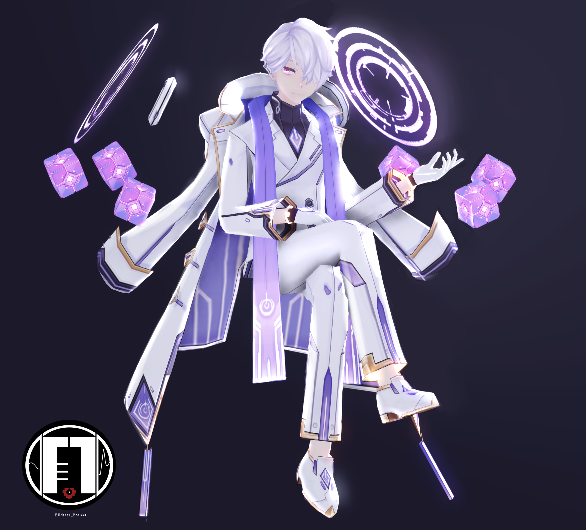
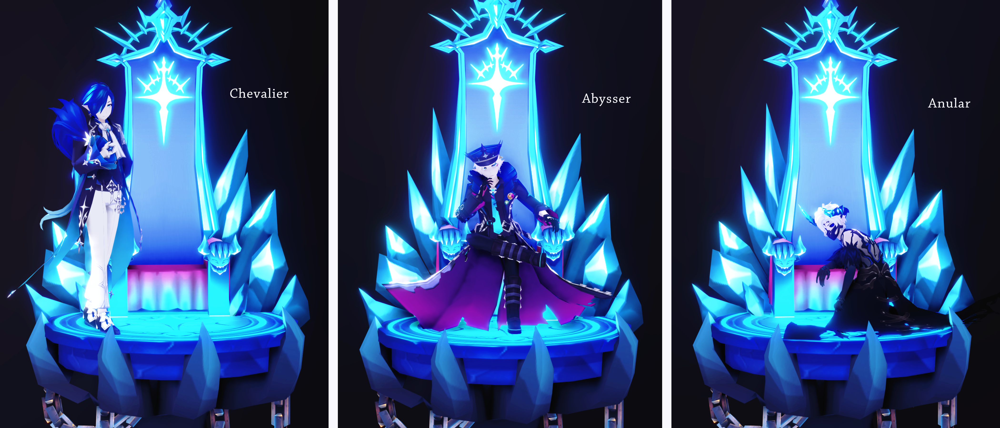

# ▉ 模組下載 ▉  

## ▏2019.5.21 MAZE 組合繫列 （停止配佈） ▏
 

### ▶ [BowRoll 下載頁面](https://bowlroll.net/file/198273)

## ▏2019.5.31 暗影執事 & 邪恐夜皇 模組整合 （停止配佈） ▏

###  ▶ [BowRoll 下載頁面](https://bowlroll.net/file/199004)

###  ▶ [BowRoll 下載頁面](https://bowlroll.net/file/199005) 

## ▏2019.7.3 & 7.4 ADD三轉模組整合 ▏

### ▶ [BowlRoll 下載頁面](https://bowlroll.net/file/201755)

###  如果你對密碼提示感覺困難，請先閱讀 [這個](https://euthana.github.io/EUthana_Project/About_Pass/) 頁面

### • bowlroll 密碼:

請使用英文回答這個問題 （※ 包含大小寫和空格）

01110100 01101000 01101001 01110011 00100000 01100011 01101000 01100001 01110010 01100001 01100011 01110100 01100101 01110010 00100111 01110011 00100000 01100110 01110101 01101100 01101100 00100000 01101110 01100001 01101101 01100101 

### • Zip 壓縮包解壓密碼:

請使用英文回答這個問題 （※ 包含大小寫和空格）

01001001 01101110 00100000 01110100 01101000 01100101 00100000 01001010 01100001 01110000 01100001 01101110 01100101 01110011 01100101 00100000 01110011 01100101 01110010 01110110 01100101 01110010 00101100 00100000 01000001 01100100 01100100 00100111 01110011 00100000 01000100 01111001 01101110 01100001 01101101 01101111 01110011 00100000 01100001 01110010 01100101 00100000 01110010 01100101 01101110 01100001 01101101 01100101 01100100 00100000 01110100 01101111 00100000 00111111 

### • 毀滅使者

該角色有多少尾巴狀金屬裝飾物，請用純數字回答。

### • 獨裁司令	

該分支的職業背景和該角色的哪個分支的職業背景相似？請回答職業名字。（※ 包含大寫以及空格）

### • 反逆之理

反逆之理已經不再是個物理意義上的存在，成為了時空中無固定姿態的--？--，這也是立繪為幼年形態的原因，請回答‘？’的英文（※無空格，全小寫，建議參照elwiki的英文職業花絮進行填空）

## ▏ 2019.8.12 亞殷模組整合 ▏

### ▶ [BowlRoll 下載頁面](https://bowlroll.net/file/205019)

###  如果你對密碼提示感覺困難，請先閱讀 [這個](https://euthana.github.io/EUthana_Project/About_Pass/) 頁面

### • bowlroll 密碼:

請使用英文回答這個問題 （※ 包含大小寫和空格）

01110100 01101000 01101001 01110011 00100000 01100011 01101000 01100001 01110010 01100001 01100011 01110100 01100101 01110010 00100111 01110011 00100000 01100110 01110101 01101100 01101100 00100000 01101110 01100001 01101101 01100101 

### • ZIP 解壓密碼:

01101110 01100001 01101101 01100101 00100000 01101111 01100110 00100000 01110100 01101000 01100101 00100000 01100111 01101111 01100100 00100000 01101111 01100110 00100000 01101100 01101001 01100111 01101000 01110100 00100110 01101110 01100001 01101101 01100101 00100000 01101111 01100110 00100000 01110100 01101000 01100101 00100000 01100111 01101111 01100100 00100000 01101111 01100110 00100000 01100100 01100001 01110010 01101011 01101110 01100101 01110011 01110011 

密碼格式為Aaaa&Bbbb，並且沒有空格

### • 角色模組密碼:

請使用英文輸入 （※ 包含大小寫和空格）

▷ 馭法尊者--

▷ 侍心尊者--

▷ 終焉叛神--

#### 商城購買的轉職道具

#### 我推薦的物理模擬參數
#### (如果你需要保持角色的服飾為懸浮狀態，建議使用該參數)

## ▏2019.10.12 亞殷武器模組整合 ▏

### ▶ [BowlRoll 下載頁面](https://bowlroll.net/file/208825)

### • bowlroll 密碼:

## ▏2019.12.12 希爾三轉模組整合  ▏

### ▶ [BowlRoll 下載頁面](https://bowlroll.net/file/213606)

###  如果你對密碼提示感覺困難，請先閱讀 [這個](https://euthana.github.io/EUthana_Project/About_Pass/) 頁面

### • bowlroll 密碼:

please use English to answer this question （※ case sensitive and space）

01110100 01101000 01101001 01110011 00100000 01100011 01101000 01100001 01110010 01100001 01100011 01110100 01100101 01110010 00100111 01110011 00100000 01100110 01110101 01101100 01101100 00100000 01101110 01100001 01101101 01100101 

### • ZIP 解壓密碼:

01110111 01101000 01100001 01110100 00100000 01101001 01110011 00100000 01000011 01101001 01100101 01101100 00100111 01110011 00100000 01100100 01100101 01100011 01100001 01110011 01100101 01100100 00100000 01110011 01101001 01110011 01110100 01100101 01110010 00100111 01110011 00100000 01101110 01100001 01101101 01100101 00111111 

### • 角色模組密碼:

請使用英文輸入 （※ 包含大小寫和空格）

▷ 深海茗皇--

▷ 隨從武士--

▷ 雅洛拉--

#### 商城購買的轉職道具

## ▏2019.12.27 trinityACE 組合模組整合  ▏

### ▶ [BowRoll 下載頁面](https://bowlroll.net/file/214499)

## 2020.03.24 少女解剖字幕+附件下載

### ▶ [BowRoll 下載頁面](https://bowlroll.net/file/221225)

### ● ZIP 解壓密碼: 

The name of the character which shown on the 3rd min of PV (All Capital letters)

## ▏2020.04.27 2020 婚禮模組 ▏

### ▶ [BowlRoll 下載頁面](https://bowlroll.net/file/224285)

#### bowlroll 密碼:

## ▏2020.05.10 愛德華&格蕾絲模組整合 ▏

### ▶ [BowlRoll 下載頁面](https://bowlroll.net/file/225888)

### ● bowlroll 密碼:

### ● Zip 解壓密碼:

為了保護愛德華，他的母親將他送往多少年後的未來？（請用純數字回答）

#### 密碼提示

你可以在ADD有聲漫畫系列，以及領導者系列迷宮劇情或者 [格蕾絲人物頁面](https://elwiki.net/w/Grace)找到密碼信息

# ▉ 關於我們  ▉

Hi there !This is EUthana P & EVE ^^ 

This is a blog about my MMD models & Original MMD PV, mostly it contains DL link and model & PV  preview image.

If you have any question about these models, please contact us.

▷ Tiwtter : EUthana_Lau    

▷ Weibo：EUthanaP

▷ bilibili：EUthanaP
