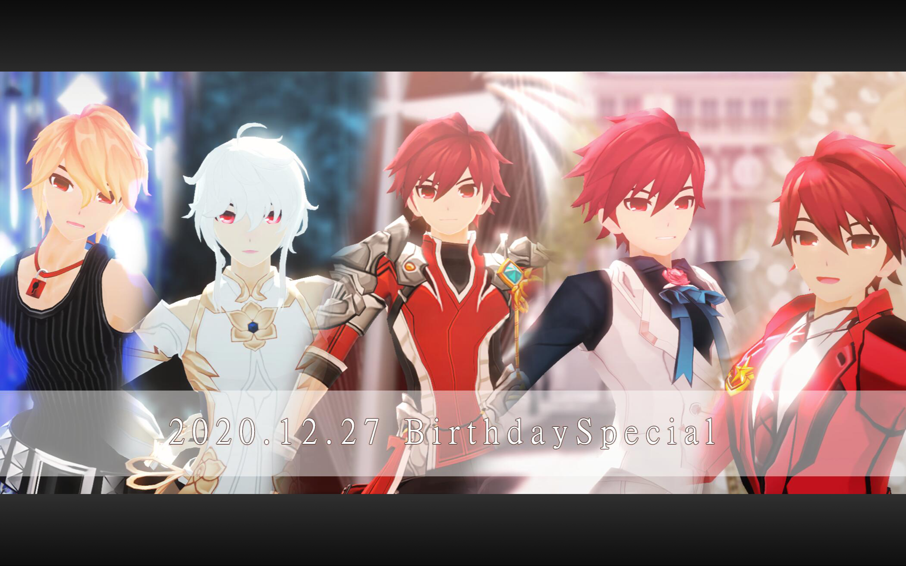
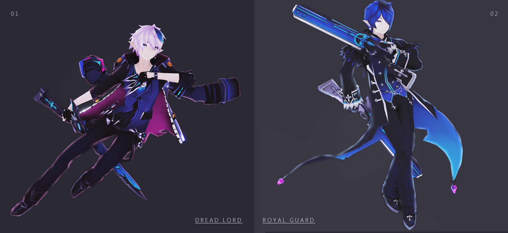

# ▉ Model/Motion Distribution ▉  

## ▏2021.6.13 Angelphobia Model Pack DL▏

### ▶ [BowlRoll DL Page](https://bowlroll.net/file/256125)

### ● bowlroll Pass:

## ▏2021.6.13 TAEMIN - Criminal Motion DL▏

### ▶ [BowlRoll DL Page](https://bowlroll.net/file/256124)

### ● bowlroll pass:

The 8 numbers shown at 1:29 of the video.（No other symbols）

## ▏2021.5.14 Ara-Shakti Model DL▏

### ▶ [BowlRoll DL Page](https://bowlroll.net/file/254127)

### ● bowlroll pass:

The job's name is abbreviated by ...(8 traditional Chinese characters, no punctuation/space)

### If you have no idea with the tips,read [this](https://euthana.github.io/EUthana_Project/About_Pass/) first please.

## ▏2021.4.30 Noah-Elite Model Pack DL  Thanks for 1300 Followers!▏

### ▶ [BowlRoll DL Page](https://bowlroll.net/file/253032)

### ● bowlroll pass:

## ▏2021.4.30 Dream of You Stage DL▏

### ▶ [BowlRoll DL Page](https://bowlroll.net/file/253028)

## ▏2021.4.30 Elite Outfit DL▏

### ▶ [BowlRoll DL Page](https://bowlroll.net/file/253031)

### ● bowlroll pass:

## ▏2021.4.17 Noah-Basic Job+Moon Welcoming Model DL▏

### ▶ [BowlRoll DL page](https://bowlroll.net/file/252154)

### ● bowlroll pass:

What is the name of Noah's weapon？

## ▏2021.3.26 Noah-TrinityACE！▏

### ▶ [BowlRoll DL page](https://bowlroll.net/file/250760)

### ● bowlroll pass:

## ▏2021.3.10 Nyx Pieta Pack▏

### ▶ [BowlRoll DL page](https://bowlroll.net/file/249619)

### ● bowlroll pass:

Noah had seen beautiful flowers with Harque on a hill, what color were the flowers? (five letters, all lowercase)

## ▏2021.2.27 Forever Secret▏

### ▶ [BowlRoll DL page](https://bowlroll.net/file/248798)

### ● bowlroll pass:

## ▏2021.2.9 Celestia & Clamor Pack▏

### ▶ [BowlRoll DL page](https://bowlroll.net/file/247287)

### ● bowlroll pass:

How old was Noah when he became Celestia? (Please answer with numbers)

## ▏2021.1.22 Apostasia AprilMaid.ver Thanks for 1100 Followers! ▏

### ▶ [BowlRoll DL page](https://bowlroll.net/file/245887)

### ● bowlroll pass:

## ▏2021.1.13 Noah-Liberator & Moon Master Pack▏

### ▶ [BowlRoll DL](https://bowlroll.net/file/245292)

### ● bowlroll pass:

What is the last name of the moon master?

## ▏2020.12.27 2020 Elsword Birthday Special ▏

### ▶ [BowlRoll DL](https://bowlroll.net/file/243746)

### ● bowlroll pass:

Which game studio makes ELSOWRD?（All capitalization in English）

### ● Zip pass:
Which skill does KE's eyes turn completely blue when he uses it?（All English lowercase without spaces,17 characters in total）

#### pass hint

Check KE's page on Elwiki or Ask Elsword players please ;3

## ▏2020.11.16 Chungha-Snapping Stage ▏

### ▶ [BowlRoll DL](https://bowlroll.net/file/240824)

## ▏2020.11.16 Herrscher&Henir Pack ▏

### ▶ [BowlRoll DL](https://bowlroll.net/file/240825)

### ● bowlroll pass:

## ▏2020.09.12 Ain Bluhen 1.02 Beta Version ▏

### ▶ [BowlRoll DL](https://bowlroll.net/file/236010)

### ● bowlroll pass:

## ▏2020.05.10 Grace & Edward ▏

### ▶ [BowlRoll DL page](https://bowlroll.net/file/225888)

### ● bowlroll pass:

### ● Zip pass:

In order to protect Edward, how many years did Grace send him in the future? (please answer with number/numbers)

#### pass hint 

You could find password at Official character comic 'Quantum Leap', Master Dungeon story and  [Grace's legacy](https://elwiki.net/w/Grace)

## ▏2020.04.27 Lofty: Wanderer Wedding 2020 ▏

### ▶ [BowlRoll DL page](https://bowlroll.net/file/224285)

#### bowlroll pass:

## 2020.03.24 Otome Kaibou Accessory DL

### ▶ [BowRoll DL page](https://bowlroll.net/file/221225)

### ● ZIP pass: 

The name of the character which shown on the 3rd min of PV (All Capital letters)

## ▏2019.12.27 trinityACE Pack DL  ▏

### ▶ [BowRoll DL page](https://bowlroll.net/file/214499)

## ▏2019.10.12 Ain weapon Pack DL ▏

### ▶ [BowlRoll DL page](https://bowlroll.net/file/208825)

### • bowlroll pass:

## ▏2019.12.12 Ciel 3rd Job Pack DL  ▏

### ▶ [BowlRoll DL page](https://bowlroll.net/file/213606)

### If you have no idea with the tips,read [this](https://euthana.github.io/EUthana_Project/About_Pass/) first please.

### • bowlroll pass:

please use English to answer this question （※ case sensitive and space）

01110100 01101000 01101001 01110011 00100000 01100011 01101000 01100001 01110010 01100001 01100011 01110100 01100101 01110010 00100111 01110011 00100000 01100110 01110101 01101100 01101100 00100000 01101110 01100001 01101101 01100101 

### • ZIP pass:

01110111 01101000 01100001 01110100 00100000 01101001 01110011 00100000 01000011 01101001 01100101 01101100 00100111 01110011 00100000 01100100 01100101 01100011 01100001 01110011 01100101 01100100 00100000 01110011 01101001 01110011 01110100 01100101 01110010 00100111 01110011 00100000 01101110 01100001 01101101 01100101 00111111 

### • Character pass:

Please enter the item's name in English. （※ case sensitive and space）

▷ Abysser--

▷ Chevalier--

▷ Anular--

#### key words:Job change item

## ▏ 2019.8.12 Ain Model Pack DL ▏

### ▶ [BowlRoll DL page](https://bowlroll.net/file/205019)

### If you have no idea with the tips,read [this](https://euthana.github.io/EUthana_Project/About_Pass/) first please.

### • bowlroll pass:

please use English to answer this question （※ case sensitive and space）

01110100 01101000 01101001 01110011 00100000 01100011 01101000 01100001 01110010 01100001 01100011 01110100 01100101 01110010 00100111 01110011 00100000 01100110 01110101 01101100 01101100 00100000 01101110 01100001 01101101 01100101 

### • ZIP pass:

01101110 01100001 01101101 01100101 00100000 01101111 01100110 00100000 01110100 01101000 01100101 00100000 01100111 01101111 01100100 00100000 01101111 01100110 00100000 01101100 01101001 01100111 01101000 01110100 00100110 01101110 01100001 01101101 01100101 00100000 01101111 01100110 00100000 01110100 01101000 01100101 00100000 01100111 01101111 01100100 00100000 01101111 01100110 00100000 01100100 01100001 01110010 01101011 01101110 01100101 01110011 01110011 

the pass format is (Aaaa&Bbbb)and no space

### • Character pass:

Please enter the item's name in English. （※ case sensitive and space）

▷ Richter--

▷ Bluhen--

▷ Herrscher--

#### key words:Job change item 

#### gravity manipuation I used in my PV  
#### (if you need to keep their costume floating,you could try them)

## ▏2019.7.3 & 7.4 ADD MODEL PACK DL ▏

### ▶ [BowlRoll DL page](https://bowlroll.net/file/201755)

###  If you have no idea with the hint,read [this](https://euthana.github.io/EUthana_Project/About_Pass/) first please.

### • bowlroll pass:

please use English to answer this question （※ case sensitive and space）

01110100 01101000 01101001 01110011 00100000 01100011 01101000 01100001 01110010 01100001 01100011 01110100 01100101 01110010 00100111 01110011 00100000 01100110 01110101 01101100 01101100 00100000 01101110 01100001 01101101 01100101 

### • Zip Pass:

please use English to answer this question （※ case sensitive and space）

01001001 01101110 00100000 01110100 01101000 01100101 00100000 01001010 01100001 01110000 01100001 01101110 01100101 01110011 01100101 00100000 01110011 01100101 01110010 01110110 01100101 01110010 00101100 00100000 01000001 01100100 01100100 00100111 01110011 00100000 01000100 01111001 01101110 01100001 01101101 01101111 01110011 00100000 01100001 01110010 01100101 00100000 01110010 01100101 01101110 01100001 01101101 01100101 01100100 00100000 01110100 01101111 00100000 00111111 

### • DoomBringer's pass

How many tail-like belts does this character have? Please answer with number(s).

### • Dominator's pass

Dominator's backstory references whos's backstory? Only the class name.（※ case sensitive and space）

### • MadParadox's pass

Mad Paradox now become an --?-- in time and space with a fluctuating appearance,explaining his child-like default appearance.Please answer the word ‘？’

## ▏2019.5.31 RG & DL Model （DL DOWN） ▏

 
## ▏2019.5.21 MAZE Group Model Pack （DL DOWN） ▏
 

# ▉ About us  ▉
Hi there !This is EUthana P & EVE ^^ 

This is a blog about my MMD models & Original MMD PV, mostly it contains DL link and model & PV  preview image.

If you have any question about these models, please contact us.

▷ Tiwtter : EUthana_Lau    

▷ Weibo：EUthanaP
