##  한국어 페이지 번역은 @S_hanren 님의 도움을 받았습니다. 

## 도와주셔서 감사합니다. uvu

# ▉ 모델 팩 다운로드 ▉  

## ▏2021.2.27 영원한 비밀▏

### ▶ [BowlRoll 페이지](https://bowlroll.net/file/248798)

### ● bowlroll 비밀번호:

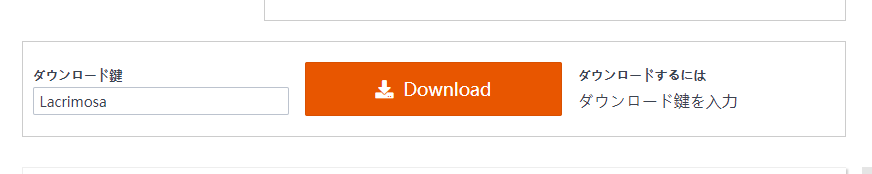

## ▏2021.2.9 셀레스티아 & 클라모르 모델 팩▏

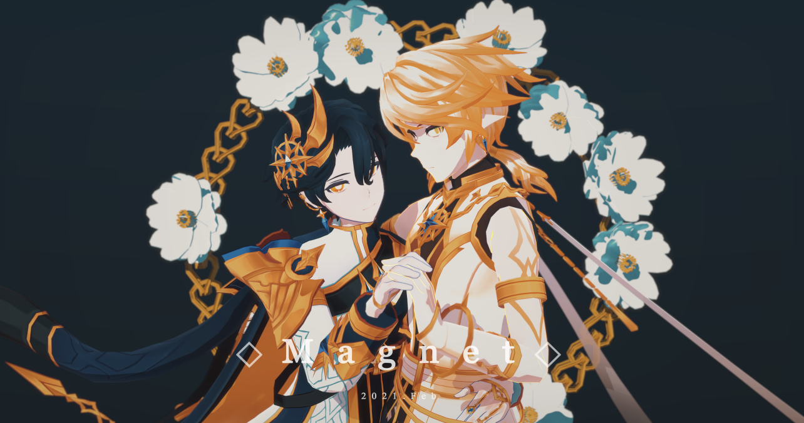

### ▶ [BowlRoll 페이지](https://bowlroll.net/file/247287)

### ● bowlroll 비밀번호:

노아는 2라인 3차 전직에 도달했을 때 몇 살이었습니까?

## ▏2021.1.22 아포스타시아 4월의 메이드  1100 팔로워의 사례! ▏

### ▶ [BowlRoll 페이지](https://bowlroll.net/file/245887)

### ● bowlroll 비밀번호:

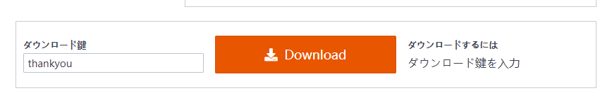

## ▏2021.1.13 노아-리버레이터 & 달의 마스터 이벨른 팩▏

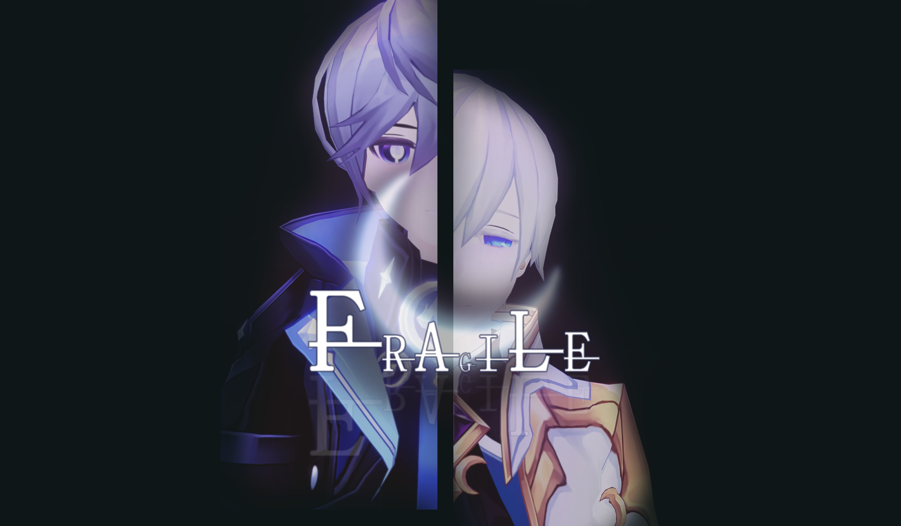

### ▶ [BowlRoll 페이지](https://bowlroll.net/file/245292)

### ● bowlroll 비밀번호:

노아와 달의 마스터의 성을 영어로? (첫 번째 문장은 대문자로, 나머지는 소문자입니다.)

## ▏2020.12.27 2020 엘소드 생일 선물 ▏

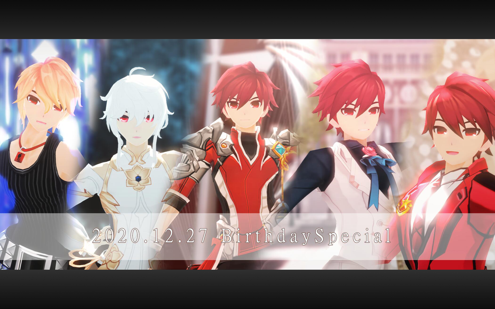

### ▶ [BowlRoll 페이지](https://bowlroll.net/file/243746)

### ● bowlroll 비밀번호:

엘소드 게임은 어느 회사에서 만들었습니까? (비밀번호는 영어이며 대문자입니다.)

### ● Zip 비밀번호:
나이트 엠퍼러의 눈은 어떤 스킬을 사용할 때, 눈이 파랗게 변하나요? (비밀번호는 공백 없이 모든 영어는 소문자이며 총 17글자입니다.)

#### 비밀번호 힌트

Elwiki 페이지에서 찾아보거나 Knight Emperor 플레이어에게 물어보세요! ;3

## ▏2020.11.16 김청하-Snapping 무대 ▏

### ▶ [BowlRoll 페이지](https://bowlroll.net/file/240824)

## ▏2020.11.16 헤르셔&헤니르 모델 팩 ▏

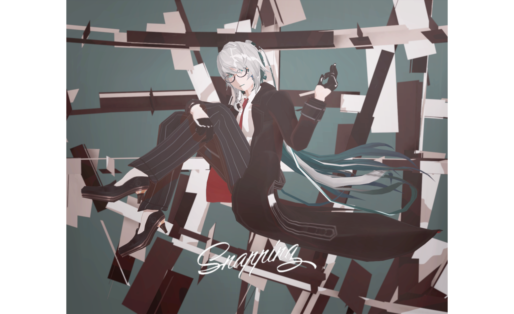

### ▶ [BowlRoll 페이지](https://bowlroll.net/file/240825)

### ● bowlroll 비밀번호:

## ▏2020.09.12 아인 블루헨 1.02 Beta 버전 ▏

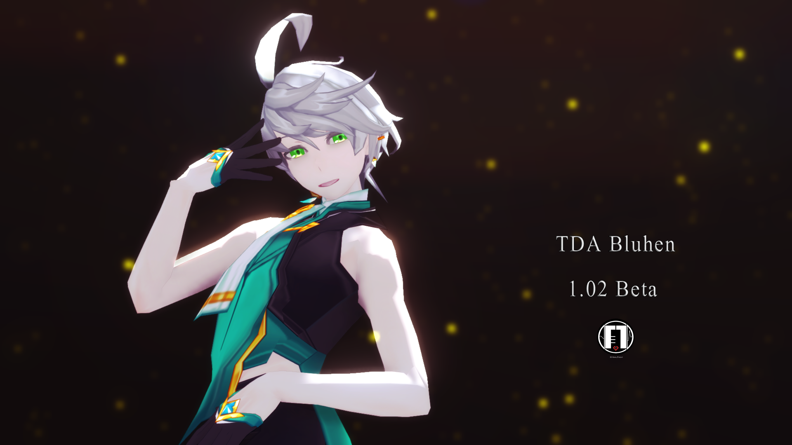

### ▶ [BowlRoll 페이지](https://bowlroll.net/file/236010)

### ● bowlroll 비밀번호:

## ▏2020.05.10 그레이스&에드워드 모델 팩 ▏

### ▶ [BowlRoll 페이지](https://bowlroll.net/file/225888)

### ● bowlroll 비밀번호:

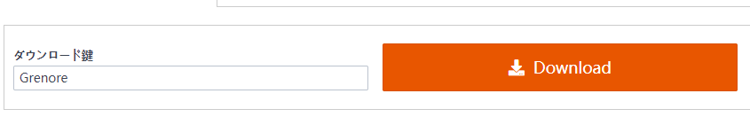

### ● Zip 비밀번호:

에드워드를 보호하기 위해 그레이스는 그를 몇 년 이후로 보냈습니까? (*숫자로 답해주세요)

#### 비밀번호 힌트

공식 캐릭터 코믹 '퀀텀리프', 그레이스의 유산에서 비밀번호를 찾을 수 있습니다. (*영어이며, 엘위키(영문)를 참고하시는 것을 권장합니다.)  [Grace's legacy](https://elwiki.net/w/Grace)

## ▏2020.04.27 2020 롭티 : 원더러 웨딩 팩 ▏

### ▶ [BowlRoll 페이지](https://bowlroll.net/file/224285)

#### bowlroll 비밀번호:

## 2020.03.24 소녀해부 악세서리 팩

### ▶ [BowRoll 페이지](https://bowlroll.net/file/221225)

### ● ZIP 비밀번호: 

The name of the character which shown on the 3rd min of PV (All Capital letters)

## ▏2019.12.27 trinityACE 모델 팩 ▏

### ▶ [BowRoll 페이지](https://bowlroll.net/file/214499)

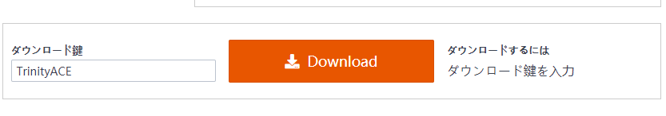

## ▏2019.12.12 시엘 3차 모델 팩  ▏

### ▶ [BowlRoll 페이지](https://bowlroll.net/file/213606)

###  만약 당신이 비밀번호를 해제하는 것에 어려움을 느낀다면, 이 페이지를 먼저 읽어봐주세요.
 [▶](https://euthana.github.io/EUthana_Project/About_Pass/) 

### • bowlroll 비밀번호:

질문에 대한 답을 영문으로 입력해주세요. (*대소문자와 띄어쓰기를 구분합니다)

01110100 01101000 01101001 01110011 00100000 01100011 01101000 01100001 01110010 01100001 01100011 01110100 01100101 01110010 00100111 01110011 00100000 01100110 01110101 01101100 01101100 00100000 01101110 01100001 01101101 01100101 

### • ZIP 비밀번호:

01110111 01101000 01100001 01110100 00100000 01101001 01110011 00100000 01000011 01101001 01100101 01101100 00100111 01110011 00100000 01100100 01100101 01100011 01100001 01110011 01100101 01100100 00100000 01110011 01101001 01110011 01110100 01100101 01110010 00100111 01110011 00100000 01101110 01100001 01101101 01100101 00111111 

### • Character 비밀번호:

해당 아이템이름을 영어로 입력해주세요. (*대소문자와 띄어쓰기를 구분하며, 엘위키(영문)를 참고하시는 것을 권장합니다.)

▷ 어비셔--

▷ 슈발리에--

▷ 아눌라르--

#### 키워드:전직아이템

## ▏2019.10.12 아인 무기 모델 팩 ▏

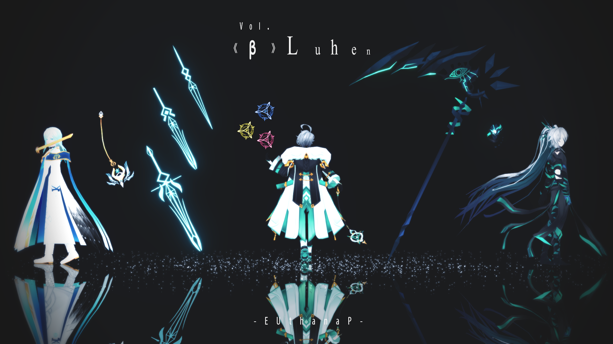

### ▶ [BowlRoll 페이지](https://bowlroll.net/file/208825)

### • bowlroll 비밀번호:

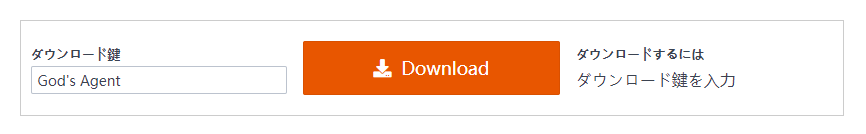

## ▏ 2019.8.12 아인 3차 모델 팩 ▏

### ▶ [BowlRoll 페이지](https://bowlroll.net/file/205019)

### 만약 당신이 비밀번호를 해제하는 것에 어려움을 느낀다면, 이 페이지를 먼저 읽어봐주세요. [▶](https://euthana.github.io/EUthana_Project/About_Pass/) 

### • bowlroll 비밀번호:

질문에 대한 답을 영문으로 입력해주세요. (*대소문자와 띄어쓰기를 구분합니다)

01110100 01101000 01101001 01110011 00100000 01100011 01101000 01100001 01110010 01100001 01100011 01110100 01100101 01110010 00100111 01110011 00100000 01100110 01110101 01101100 01101100 00100000 01101110 01100001 01101101 01100101 

### • ZIP 비밀번호:

01101110 01100001 01101101 01100101 00100000 01101111 01100110 00100000 01110100 01101000 01100101 00100000 01100111 01101111 01100100 00100000 01101111 01100110 00100000 01101100 01101001 01100111 01101000 01110100 00100110 01101110 01100001 01101101 01100101 00100000 01101111 01100110 00100000 01110100 01101000 01100101 00100000 01100111 01101111 01100100 00100000 01101111 01100110 00100000 01100100 01100001 01110010 01101011 01101110 01100101 01110011 01110011 

비밀번호의 형식은 (Aaaa & Bbbb)이며 띄어쓰기는 없습니다.

### • Character 비밀번호:

해당 아이템이름을 영어로 입력해주세요. (*대소문자와 띄어쓰기를 구분하며, 엘위키(영문)를 참고하시는 것을 권장합니다.)

▷ 리히터--

▷ 블루헨--

▷ 헤르셔--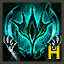

#### 키워드:전직아이템

#### 내가 만든 영상에서 사용한 중력 조작의 값은 이렇습니다.
#### (만약 당신이 의상을 떠있게 유지해야하는 경우 시도해 볼 수 있습니다.)

## ▏2019.7.3 & 7.4 애드 3차 모델팩 ▏

### ▶ [BowlRoll 페이지](https://bowlroll.net/file/201755)

###  만약 당신이 비밀번호를 해제하는 것에 어려움을 느낀다면, 이 페이지를 먼저 읽어봐주세요. [▶](https://euthana.github.io/EUthana_Project/About_Pass/) 

### • bowlroll 비밀번호:

질문에 대한 답을 영문으로 입력해주세요. (*대소문자와 띄어쓰기를 구분합니다)

01110100 01101000 01101001 01110011 00100000 01100011 01101000 01100001 01110010 01100001 01100011 01110100 01100101 01110010 00100111 01110011 00100000 01100110 01110101 01101100 01101100 00100000 01101110 01100001 01101101 01100101 

### • Zip 비밀번호:

질문에 대한 답을 영문으로 입력해주세요. (*대소문자와 띄어쓰기를 구분합니다)

01001001 01101110 00100000 01110100 01101000 01100101 00100000 01001010 01100001 01110000 01100001 01101110 01100101 01110011 01100101 00100000 01110011 01100101 01110010 01110110 01100101 01110010 00101100 00100000 01000001 01100100 01100100 00100111 01110011 00100000 01000100 01111001 01101110 01100001 01101101 01101111 01110011 00100000 01100001 01110010 01100101 00100000 01110010 01100101 01101110 01100001 01101101 01100101 01100100 00100000 01110100 01101111 00100000 00111111 

### • 둠 브링어 비밀번호

꼬리 모양 장식물이 몇 개나 되는지 숫자로 대답해주세요.

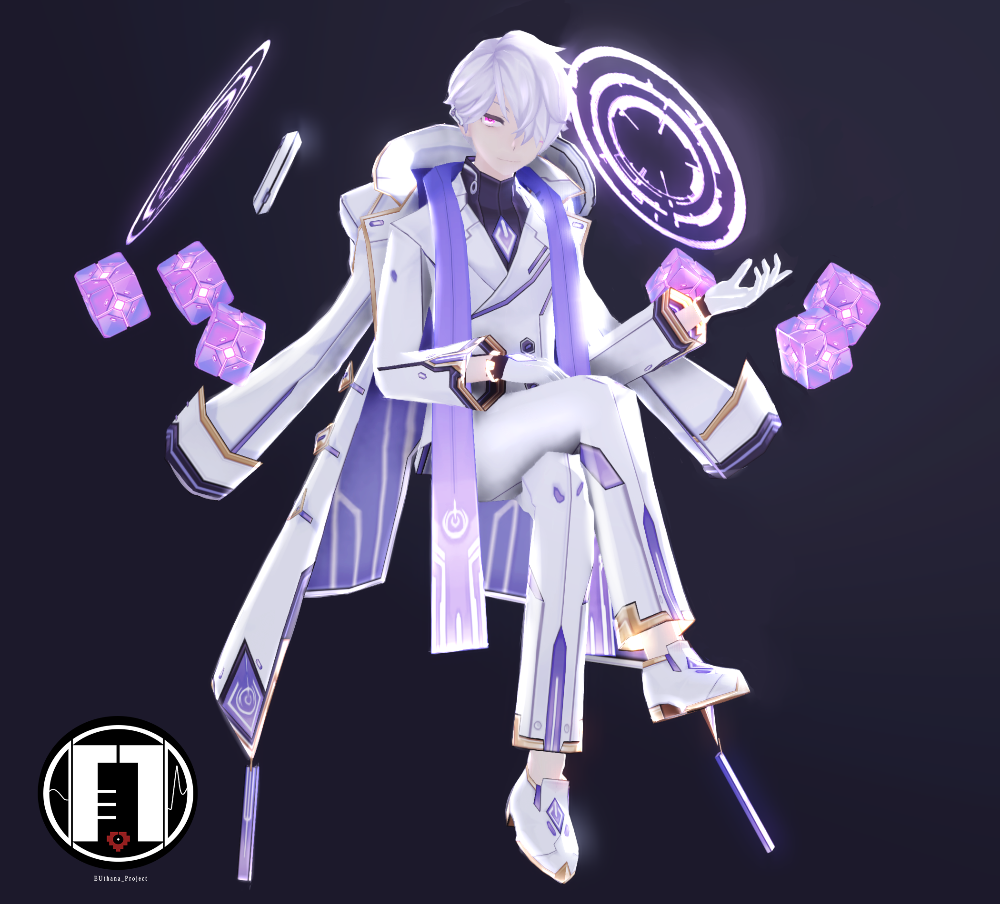

### • 도미네이터 비밀번호

도미네이터의 뒷이야기는 누구의 뒷 이야기를 참고했습니까. 클래스 명만 입력해주세요(*대소문자와 띄어쓰기를 구분합니다)

### • 매드패러독스 비밀번호

Mad Paradox is no longer a physical being. Instead, he is now an ---?--- in time and space with a fluctuating appearance, explaining his child-like default appearance. 영어 문장에 들어갈 영어 단어를 입력해주세요.(*공란없이 모두 소문자이며, 엘위키(영문)에 해당 문장으로 된 영문이 존재합니다. 너무 어렵다면 개인적으로 연락해주세요.)

## ▏2019.5.31 드레드로드 & 로열가드 모델 (단종) ▏
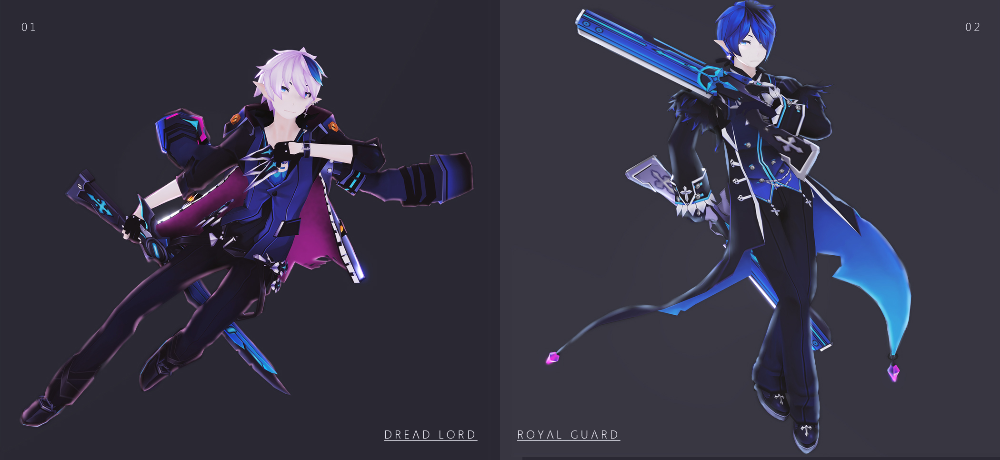

## ▏2019.5.21 MAZE 모델 시리즈 (단종) ▏
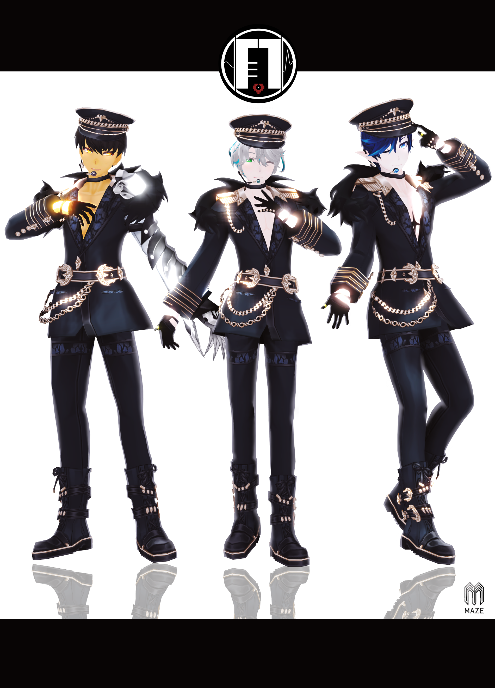 

# ▉ 소개글  ▉

안녕하세요! 나는 EUthana P & EVE라고 합니다. ^^

이것은 원래 내 MMD 모델 및 MMD PV에 대한 사이트이며, 대부분 모델 팩의 링크와 모델 및 PV미리보기가 포함되어 있습니다.

이 모델에 대한 질문이 있으시면 연락해주세요.

▷ Tiwtter : EUthana_Lau    

▷ Weibo：EUthanaP
