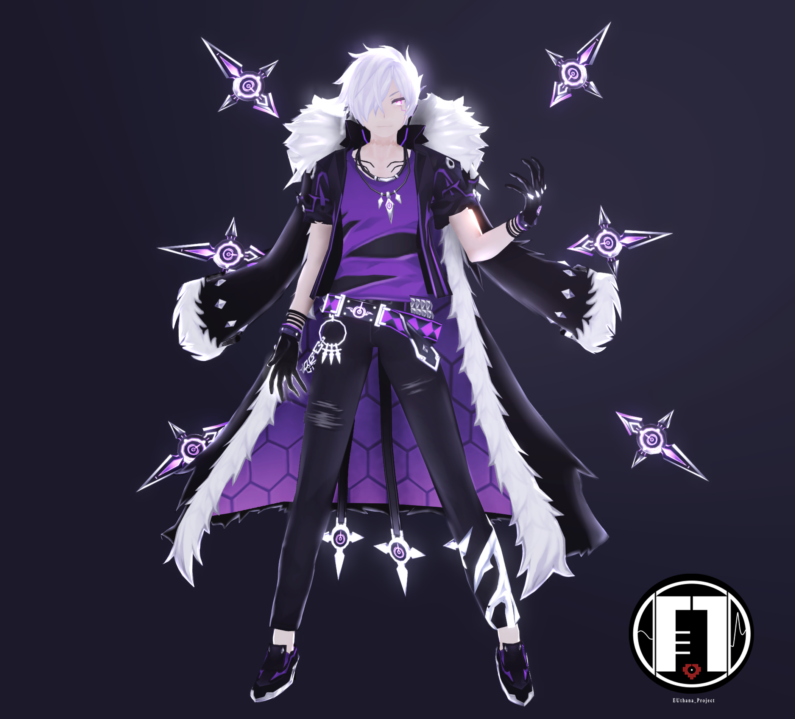

# ▉ 모형 다운로드 ▉  

## ▏2019.5.21 MAZE 모듈러조합 （닫다） ▏
 

### ▶ [BowRoll DL page](https://bowlroll.net/file/198273)

## ▏2019.5.31 RG & DL Model （닫다） ▏

###  ▶ [DreadLord 페이지](https://bowlroll.net/file/199004)

###  ▶ [RoyalGuard 페이지](https://bowlroll.net/file/199005) 

## ▏2019.7.3 & 7.4 애드 모듈러조합 ▏

### ▶ [BowlRoll 페이지](https://bowlroll.net/file/201755)

###  만약 당신이 비밀번호 제시에 어려움을 느낀다면, 이 페이지를 먼저 읽어봐. [▶](https://euthana.github.io/EUthana_Project/About_Pass/) 

### • bowlroll 비밀번호:

질문에 대한 답을 영문으로 입력해죠 （※ case sensitive and space）

01110100 01101000 01101001 01110011 00100000 01100011 01101000 01100001 01110010 01100001 01100011 01110100 01100101 01110010 00100111 01110011 00100000 01100110 01110101 01101100 01101100 00100000 01101110 01100001 01101101 01100101 

### • Zip 비밀번호:

질문에 대한 답을 영문으로 입력해죠 （※ 영어 알파벳은 대소문자 구별이 있고 공란도 있다）

01001001 01101110 00100000 01110100 01101000 01100101 00100000 01001010 01100001 01110000 01100001 01101110 01100101 01110011 01100101 00100000 01110011 01100101 01110010 01110110 01100101 01110010 00101100 00100000 01000001 01100100 01100100 00100111 01110011 00100000 01000100 01111001 01101110 01100001 01101101 01101111 01110011 00100000 01100001 01110010 01100101 00100000 01110010 01100101 01101110 01100001 01101101 01100101 01100100 00100000 01110100 01101111 00100000 00111111 

### • 둠 브링어

꼬리 모양 금속 장식물이 몇 개나 되는지 숫자로 대답해죠.

### • 도미네이터

이 지점의 배경은 이 역할의 어느 지점의 배경과 비슷할까.직업 이름에 대답해죠.(※ 대문자 및 공란 포함)

### • 매드 패러독스

매드패러독스는 더 이상 물리적인 존재가 아니어--?-- 대답'?'의 영어 (※ 공란 없이 모두 소문자이므로, 엘위키 영문 프로필을 참고하여 공란을 채울 것을 권장해.)

## ▏ 2019.8.12 아인 모듈러조합 ▏

### ▶ [BowlRoll DL page](https://bowlroll.net/file/205019)

### If you have no idea with the tips,read [this](https://euthana.github.io/EUthana_Project/About_Pass/) first please.

### • bowlroll pass:

please use English to answer this question （※ case sensitive and space）

01110100 01101000 01101001 01110011 00100000 01100011 01101000 01100001 01110010 01100001 01100011 01110100 01100101 01110010 00100111 01110011 00100000 01100110 01110101 01101100 01101100 00100000 01101110 01100001 01101101 01100101 

### • ZIP pass:

01101110 01100001 01101101 01100101 00100000 01101111 01100110 00100000 01110100 01101000 01100101 00100000 01100111 01101111 01100100 00100000 01101111 01100110 00100000 01101100 01101001 01100111 01101000 01110100 00100110 01101110 01100001 01101101 01100101 00100000 01101111 01100110 00100000 01110100 01101000 01100101 00100000 01100111 01101111 01100100 00100000 01101111 01100110 00100000 01100100 01100001 01110010 01101011 01101110 01100101 01110011 01110011 

the pass format is (Aaaa&Bbbb)and no space

### • Character pass:

Please enter the item's name in English. （※ case sensitive and space）

▷ Richter--

▷ Bluhen--

▷ Herrscher--

#### key words:Job change item 

#### gravity manipuation I used in my PV  
#### (if you need to keep their costume floating,you could try them)

## ▏2019.10.12 Ain weapon Pack DL ▏

### ▶ [BowlRoll DL page](https://bowlroll.net/file/208825)

### • bowlroll pass:

## ▏2019.12.12 Ciel 3rd Job Pack DL  ▏

### ▶ [BowlRoll DL page](https://bowlroll.net/file/213606)

### If you have no idea with the tips,read [this](https://euthana.github.io/EUthana_Project/About_Pass/) first please.

### • bowlroll pass:

please use English to answer this question （※ case sensitive and space）

01110100 01101000 01101001 01110011 00100000 01100011 01101000 01100001 01110010 01100001 01100011 01110100 01100101 01110010 00100111 01110011 00100000 01100110 01110101 01101100 01101100 00100000 01101110 01100001 01101101 01100101 

### • ZIP pass:

01110111 01101000 01100001 01110100 00100000 01101001 01110011 00100000 01000011 01101001 01100101 01101100 00100111 01110011 00100000 01100100 01100101 01100011 01100001 01110011 01100101 01100100 00100000 01110011 01101001 01110011 01110100 01100101 01110010 00100111 01110011 00100000 01101110 01100001 01101101 01100101 00111111 

### • Character pass:

Please enter the item's name in English. （※ case sensitive and space）

▷ Abysser--

▷ Chevalier--

▷ Anular--

#### key words:Job change item

## ▏2019.12.27 trinityACE Pack DL  ▏

### ▶ [BowRoll DL page](https://bowlroll.net/file/214499)

## 2020.03.24 Otome Kaibou Accessory DL

### ▶ [BowRoll DL page](https://bowlroll.net/file/221225)

### ● ZIP pass: 

The name of the character which shown on the 3rd min of PV (All Capital letters)

## ▏2020.04.27 Lofty: Wanderer Wedding 2020 ▏

### ▶ [BowlRoll DL page](https://bowlroll.net/file/224285)

#### bowlroll pass:

## ▏2020.05.10 Grace & Edward ▏

### ▶ [BowlRoll DL page](https://bowlroll.net/file/225888)

### ● bowlroll pass:

### ● Zip pass:

In order to protect Edward, how many years did Grace send him in the future? (please answer with number/numbers)

#### pass hint 

You could find password at Official character comic 'Quantum Leap', Master Dungeon story and  [Grace's legacy](https://elwiki.net/w/Grace)

# ▉ About us  ▉
Hi there !This is EUthana P & EVE ^^ 

This is a blog about my MMD models & Original MMD PV, mostly it contains DL link and model & PV  preview image.

If you have any question about these models, please contact us.

▷ Tiwtter : EUthana_Lau    

▷ Weibo：EUthanaP
