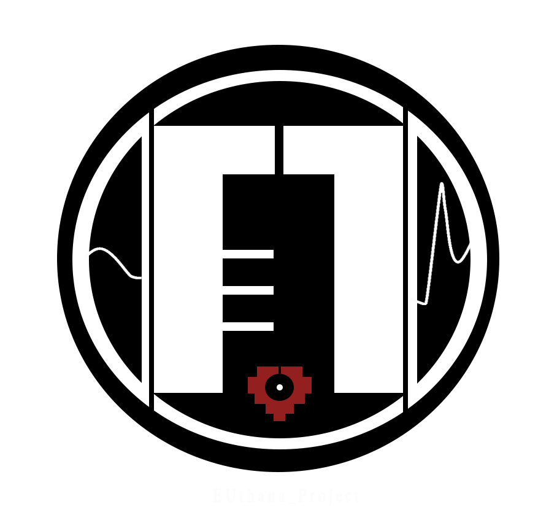
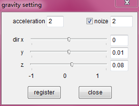

# PV Update |  PV 更新

## 2019.4.7 - アンノウン・マザーグース（Unknown Mother-Goose）

[watch this PV on YouTube](https://www.youtube.com/watch?v=EWocFcocft8)

[watch this PV on bilibili](https://www.bilibili.com/video/av48569151)

## 2019.5.21 - Chained Up (vixx) & MAZE MODEL DL

[watch this PV on YouTube](https://www.youtube.com/watch?v=MDhNm6zlfew)

[watch this PV on bilibili](https://www.bilibili.com/video/av53172362)

## 2019.5.31 - Killer Lady  RG & DL MODEL DL

[watch this PV on YouTube](https://www.youtube.com/watch?v=s6P8_odiR-s)

[watch this PV on bilibili](https://www.bilibili.com/video/av54137883)

## 2019.7.3 - Trouble Maker DB & DM MODEL DL

[watch this PV on bilibili](https://www.bilibili.com/video/av57159944/)

[watch this PV on YouTube](https://www.youtube.com/watch?v=s6P8_odiR-s)

## 2019.7.4 - Carnival  Mad Paradox MODEL DL

[watch this PV on bilibili](https://www.bilibili.com/video/av57162335/)

[watch this PV on YouTube](https://www.youtube.com/watch?v=zUz8j4FEOZw)

# PV Design Stuff （draft & WIP）|  PV 设计相关 
 

## Unknown mother-goose design draft and storyline (未知鹅妈妈童谣的分镜及剧情稿集合）
[在bilibili上阅读 Chinese version](https://www.bilibili.com/read/cv2523141)

# Model DL  | 模型配布

## 2019.5.21 MAZE Group Model Pack
 

[BowRoll DL page](https://bowlroll.net/file/198273)

Zip pass  : 2019521

Model pass : please check the numbers at the end of PV, each model requires a pass with 3 numbers. (tips: MAZE group members ' height)

模型密码提示：请查看视频末尾的数字，每个模型对应一个三位数的密码 （提示：MAZE成员对应的身高）

## 2019.5.31 RG & DL Model

[DreadLord DL page](https://bowlroll.net/file/199004)

[RoyalGuard DL page](https://bowlroll.net/file/199005) 6.3 00:16 joint update 

Model pass ：please check the numbers at the end of PV （4 numbrs）

模型密码提示：请查看视频末尾的四位数数字

PHX I used in my PV  | PV中演示的物理参数

## 2019.7.3 & 7.4 ADD MODEL PACK DL

### If you have no idea with the tips,read [this](https://euthana.github.io/EUthana_Project/About_Pass/) first please.

bowlroll pass:

please use English to answer this question （this pass contains capital letters and space）

7768617420697320746869732063686172616374657227732066756C6C206E616D653F

Zip Pass:

please use English to answer this question （this pass contains capital letters and space）

496E20746865204A6170616E657365207365727665722C2041646427732044796E616D6F73206172652072656E616D656420746F20776861743F

DB's pass

How many tail-like belts does this character have? Please answer with number(s).

DM's pass

Dominator's backstory references whos's backstory? Only the class name.

2019.7.4 MP Model pack DL

# About Password Changes |  关于密码变更

## [please read this when you have no idea with pass tips](https://euthana.github.io/EUthana_Project/About_Pass/) 

# About us  |  关于我们
Hi there !This is EUthana P & EVE ^^ 

This is a blog about my MMD models & Original MMD PV, mostly it contains DL link and model & PV  preview image.

If you have any question about these models, please contact us.

你好! 这里是EU 和 EVE ^^

这是我的关于MMD模型配布的博客，大多数会在这里发布模型配布相关和模型预览图

如果你对我的模型有任何疑问或者更新的需求，请联系我们

Tiwtter : EUthana_Lau    

Weibo：EUthanaP
